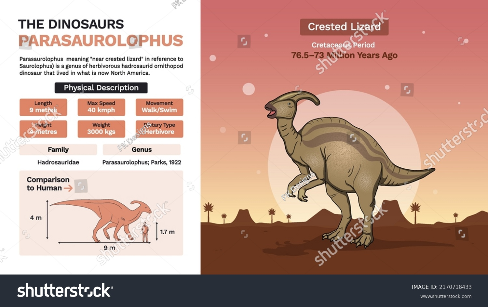

# Parasaurolophus

le Parasaurophus est un dinosaure du crétacé supérieur l'un des plus complexes de son époque avec une long crete qui lui sert d'instrument pour communiquer ou chanter 

##Caracteristique

La grande famille des Hadrosaures, ou dinosaures "à bec de canard" est le groupe d'ornithopodes les plus divers et les plus florissants du crétacé supérieur. Il n'est pas rare d'en trouver trois ou quatre espèces différentes se côtoyant dans une même formation géologique, et ils devaient se déplacer en grands troupeaux mêlés, comme aujourd'hui les antilopes en Afrique. Ils pouvaient être bipèdes ou quadrupèdes, donc se déplacer sur deux ou quatre pattes

##Sous-Especess

1.  Parasaurolophus walkeri, l'espèce-type, décrite en 1922 et possédant la crête la plus grande.
2. Parasaurolophus tubicen, décrit en 1931.
3. Parasaurolophus cyrtocristatus, décrit en 1961, il possède la crête la plus petite.

